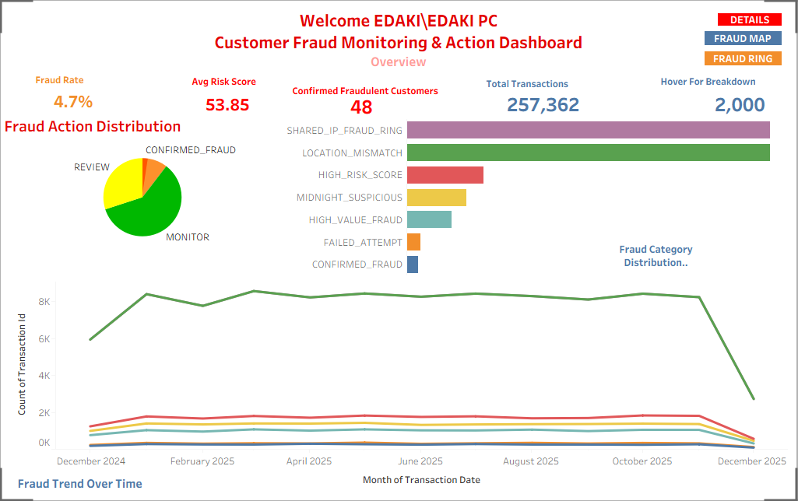
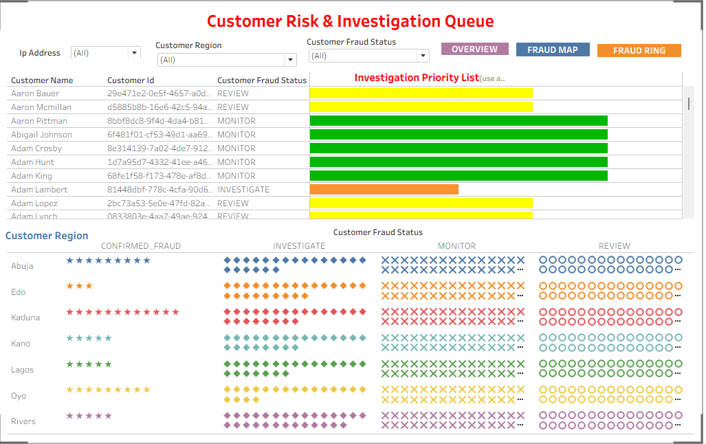
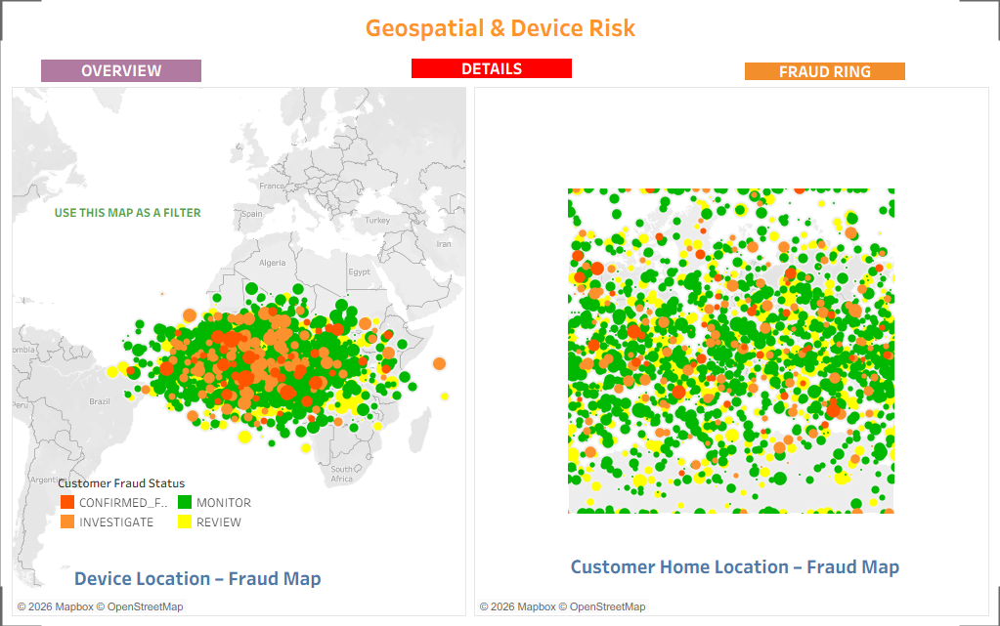

```markdown
# Tableau Dashboards – Fraud Monitoring System

This folder contains Tableau dashboards used for monitoring customer fraud risk,
investigation prioritization, geospatial risk analysis, and network fraud detection.


```
# 1. Overview Dashboard



**Purpose**
- High-level view of fraud activity across the system
- Enables quick monitoring of suspicious transactions
```

### Key Insights Enabled
- Identify dominant fraud patterns (e.g. shared IP rings, location mismatch)
- Track fraud growth or decline over time
- Understand proportion of customers under monitoring vs investigation

```
# 2. Customer Risk & Investigation Queue Dashboard



# Business Objective
Support fraud analysts by prioritizing customers requiring investigation based on
risk severity and recent suspicious behavior .
```

# Analyst Actions Supported
- Identify high-risk customers instantly
- Decide which customers to investigate first
- Reduce investigation backlog


# 3. Geospatial & Device Risk Dashboard

```
## 3. Geospatial & Device Risk Dashboard



### Interpretation
Customer and device locations differ due to VPN usage, proxy routing,
and remote fraud operations.
```

### Business Objective
Detect anomalies between customer home locations and transaction/device locations.

### Key Visuals
- Customer Home Location Fraud Map
- Device Location Fraud Map

### Fraud Patterns Detected
- Location mismatch fraud
- Cross-border device abuse
- Shared device risk clusters

### Important Note
Device and customer locations may differ due to:
- VPN usage
- Proxy routing
- Compromised devices
- Fraud rings operating remotely


```
# 4. Network & Fraud Rings Dashboard


### Fraud Indicators
- Shared IP usage across multiple customers
- Mixed fraud statuses within same IP address
```
### Business Objective
Expose coordinated fraud activities using shared IP addresses and network behavior.

### Key Visuals
- IP Address vs Customer ID Heatmap
- Customer Fraud Status Distribution by IP
- Distinct Customer Count per IP

### Fraud Indicators
- High number of customers sharing same IP
- Mixed fraud statuses within same IP block
- Repeated suspicious access patterns


## Fraud Status Color Logic
- 🟢 Monitor
- 🟡 Review
- 🟠 Investigate
- 🔴 Confirmed Fraud
```
